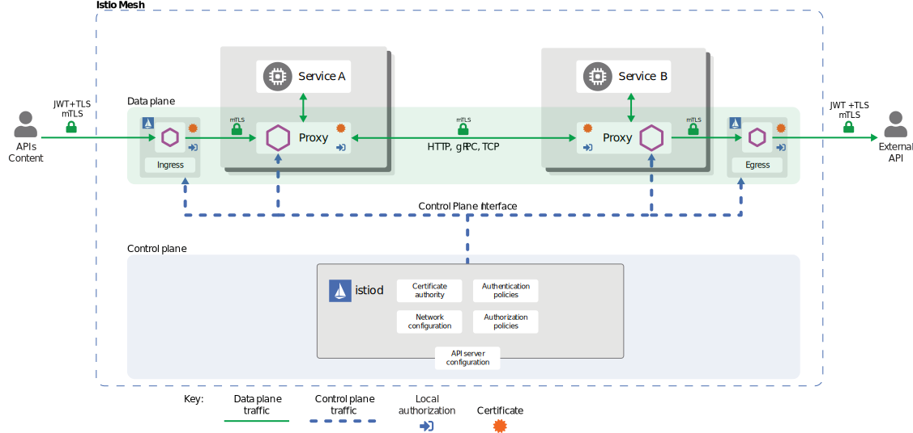
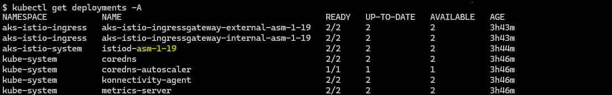

# AKS Service Mesh Using Istio

A service mesh is a dedicated infrastructure layer that controls service-to-service communication over a network. This method enables separate parts of an application to communicate with each other.

## High-Level Architecture


The service mesh is split into the following:
- a data plane - composed of Envoy proxies, deployed as a sidecar
- a control plane - manages and configures the proxies to route traffic

### Components

#### Envoy

This is a proxy that is deployed as a sidecar to every service. Here are some of its features:
- Dynamic service discovery
- Load balancing
- TLS termination
- HTTP/2 and gRPC proxies
- Circuit breakers
- Health checks
- Staged rollouts with %-based traffic split
- Fault injection
- Rich metrics

#### Istiod

Provides service discovery, configuration and certificate management, acts as a certificate authority (CA).

## Traffic Management

Istio’s traffic routing rules let you easily control the flow of traffic and API calls between services. Istio simplifies configuration of service-level properties like circuit breakers, timeouts, and retries, and makes it easy to set up important tasks like A/B testing, canary rollouts, and staged rollouts with percentage-based traffic splits.

Like other Istio configuration, the API is specified using Kubernetes custom resource definitions (CRDs) such as:
- Virtual services - configures routing rules, that are evaluated in order to a service within the service mesh
- Destination rules - it can manage traffic rules to subsets of a particular service. For example it can act as a loadbalancer
- Gateways - manages inbound/outbound traffic of the service mesh
- Service entries - allows the manage the traffic of services running outside of the mesh, including the following tasks:
  - redirect and forward traffic for external destinations
  - define retry, timeout, fault injection policies for external destinations
  - run a mesh service in a virtual machine
- Sidecars - this is basically a resource that can fine tune specific sidecar proxies to accept/decline traffic on specific ports or protocols or even limit the set of services that it can reach

## Security

### High-Level Architecture



Security in Istio involves multiple components:
- a Certificate Authority (CA)
- config API server that distributes the following to the proxies:
  - authentication policies
  - authorization policies
  - secure naming information
- sidecars work as policy enforcments points (PEPs) to secure communication between clients and servers

Basically the control plane handles the configruation from the API server and configures the PEPs in the data plane.

## Observability

Istio generates the following telemetry:
- metrics
- distributed traces
- access logs

### Metrics
Basically information about network traffic, response times, request response times, etc. Here are the categories of metrics that are generated:
- proxy-level metrics - network traffic passing through the Envoy proxy
- service-level metrics - latency, traffic, errors, saturation about services
- control plane metrics - to monitor the behaviour of Istio itself

The metrics can be exported via Prometheus and visualized in Grafana for example. There are even premade dashboards for the service-level metrics ([here](https://istio.io/latest/docs/tasks/observability/metrics/using-istio-dashboard/)).

### Distributed traces
This is basically the monitoring of individual requests from the source to its final endpoint. Istio supports a number of tracing backends such as Zipkin, Jaeger, Lightstep and Datadog.

### Access logs
Access logs provide a way to monitor and understand behavior from the perspective of an individual workload instance.

## Demo

The demo infrastructure and sample application were deployed from a Linux virtual machine (WSL). If you are using Windows or Mac, you might need to use commands, which are analogical to the Linux ones. Additionally you'll need to use

### Architecture


This is a microservice application written in multiple languages. The main purpose for this is because it shows that they do not have any dependencies on Istio. The application displays information about a book, similar to a catalog entry of an online book store. It is broken into the following 4 microservices:
- productpage - calls details and reviews to populate the page
- details - contains book information
- reviews - contains review information about the book
- ratings - contains ranking info that accompanies the book review

All of the microservices will be packaged with an Envoy sidecar that intercepts incoming and outgoing calls for the services, providing the hooks needed to externally control, via the Istio control plane, routing, telemetry collection, and policy enforcement for the application as a whole.

### Prerequisites
- [azure cli](https://learn.microsoft.com/en-us/cli/azure/install-azure-cli)
- [terrafrom](https://developer.hashicorp.com/terraform/tutorials/aws-get-started/install-cli)
- [istioctl](https://istio.io/latest/docs/setup/install/istioctl/) (only for Linux, helm instead for Windows and Mac)
- [kubectl](https://kubernetes.io/docs/tasks/tools/)
- [helm](https://helm.sh/docs/intro/install/) (use instead of istioctl if you are using Windows or Mac)

### Core Infrastructure (Cluster)

Login to Azure (you will be redirected to a browser page):
```
az login
```
Get subscription id from output and create service principal:
```
az ad sp create-for-rbac --role="Contributor" --scopes="/subscriptions/<the id output from the az login command>"
```
Set the following outputs to the following environment variables
- `appId to` `ARM_CLIENT_ID`
- `password` to `ARM_CLIENT_SECRET`
- `tenant` to `ARM_TENANT_ID`
- `id` output from `az login` to `ARM_SUBSCRIPTION_ID`

From the `infrastructure` directory run the following commands to deploy the infrastructure:
```
terraform init
terraform apply -auto-approve
```
Update the kubernetes context so you can reach the cluster (you must be in the `infrastructure` directory):
```
az aks get-credentials --name $(terraform output aks_name | sed 's/"//g') --overwrite-existing --resource-group $(terraform output resource_group_name | sed 's/"//g')
```

### Istio Infrastructure
Install the istio infrastructure using the following command (if you are using Linux):
```
istioctl install --set profile=demo
```
Install with Helm (if you are using Windows/Mac):
```
kubectl create namespace istio-system
kubectl create namespace istio-ingress
helm install istio-base istio/base -n istio-system --set defaultRevision=default
helm install istiod istio/istiod -n istio-system --wait
helm install istio-ingress istio/gateway -n istio-ingress --wait
```
(Another option) You can install the Istio AKS addon instead of Istio. However, you'll need to run the deployment command again like this:
```
terraform apply -auto-approve -var enable_istio_addon=true
```

Set the automatic sidecar injection:
- for Istio
```
kubectl label namespace default istio-injection=enabled
```
- for Istio AKS Addon
Find the revision of Istio that has been deployed. The revision name is generally in the `istiod` deployment name:



After that set the label according to the revision:
```
kubectl label namespace default istio.io/rev=asm-1-19
```

### Sample Application Deployment

Deploy the deployments, services and serviceaccounts:
```
kubectl apply -f https://raw.githubusercontent.com/istio/istio/release-1.20/samples/bookinfo/platform/kube/bookinfo.yaml
```

Deploy the Istio gateway, virtualservice and destination rules:
- for Istio deployed from `istioctl` or `helm`:
```
kubectl apply -f https://raw.githubusercontent.com/istio/istio/release-1.20/samples/bookinfo/networking/bookinfo-gateway.yaml
kubectl apply -f https://raw.githubusercontent.com/istio/istio/release-1.20/samples/bookinfo/networking/destination-rule-all.yaml
```
- for the Istio AKS addon:
```
kubectl apply -f - <<EOF
apiVersion: networking.istio.io/v1alpha3
kind: Gateway
metadata:
  name: bookinfo-gateway-external
spec:
  selector:
    istio: aks-istio-ingressgateway-external
  servers:
  - port:
      number: 80
      name: http
      protocol: HTTP
    hosts:
    - "*"
---
apiVersion: networking.istio.io/v1alpha3
kind: VirtualService
metadata:
  name: bookinfo-vs-external
spec:
  hosts:
  - "*"
  gateways:
  - bookinfo-gateway-external
  http:
  - match:
    - uri:
        exact: /productpage
    - uri:
        prefix: /static
    - uri:
        exact: /login
    - uri:
        exact: /logout
    - uri:
        prefix: /api/v1/products
    route:
    - destination:
        host: productpage
        port:
          number: 9080
EOF
kubectl apply -f https://raw.githubusercontent.com/istio/istio/release-1.20/samples/bookinfo/networking/destination-rule-all.yaml
```

Get the ingress host and port:
- for Istio, deployed by `istioctl`:
```
export INGRESS_HOST=$(kubectl get service istio-ingressgateway -n istio-system -o jsonpath='{.status.loadBalancer.ingress[0].ip}')
export INGRESS_PORT=$(kubectl get service istio-ingressgateway -n istio-system -o jsonpath='{.spec.ports[?(@.name=="http2")].port}')
```
- for Istio, deployed by `helm`:
```
export INGRESS_HOST=$(kubectl get service istio-ingressgateway -n istio-ingress -o jsonpath='{.status.loadBalancer.ingress[0].ip}')
export INGRESS_PORT=$(kubectl get service istio-ingressgateway -n istio-ingress -o jsonpath='{.spec.ports[?(@.name=="http2")].port}')
```
- for the AKS Istio addon:
```
export INGRESS_HOST=$(kubectl get service aks-istio-ingressgateway-external -n aks-istio-ingress -o jsonpath='{.status.loadBalancer.ingress[0].ip}')
export INGRESS_PORT=$(kubectl get service aks-istio-ingressgateway-external -n aks-istio-ingress -o jsonpath='{.spec.ports[?(@.name=="http2")].port}')
```

Try accessing the URL `http://<INGRESS_HOST>:<INGRESS_PORT>/productpage`

## Sources
- [Istio architecture](https://istio.io/latest/docs/ops/deployment/architecture/)
- [Envoy proxy](https://www.envoyproxy.io/)
- [Istio concepts - traffic management](https://istio.io/latest/docs/concepts/traffic-management/)
- [Istio concepts - security](https://istio.io/latest/docs/concepts/security/)
- [Istio concepts - observability](https://istio.io/latest/docs/concepts/observability/)
- [Terraform AKS resource](https://registry.terraform.io/providers/hashicorp/azurerm/latest/docs/resources/kubernetes_cluster)
- [Install Istio using istioctl](https://istio.io/latest/docs/setup/install/istioctl/)
- [Install Istio using Helm](https://istio.io/latest/docs/setup/install/helm/)
- [Istio Bookinfo sample application](https://istio.io/latest/docs/examples/bookinfo/)
- [Istio Ingress Gateways - Determining ingress IP and ports](https://istio.io/latest/docs/tasks/traffic-management/ingress/ingress-control/#determining-the-ingress-ip-and-ports)
- [Istio AKS addon](https://learn.microsoft.com/en-us/azure/aks/istio-about)
- [Deploy Istio AKS addon](https://learn.microsoft.com/en-us/azure/aks/istio-deploy-addon)
- [Deploy Istio AKS ingress](https://learn.microsoft.com/en-us/azure/aks/istio-deploy-ingress)
- [Istio tasks](https://istio.io/latest/docs/tasks/)
